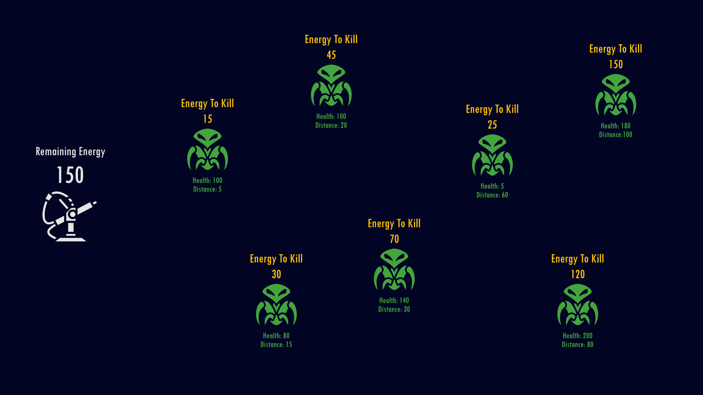
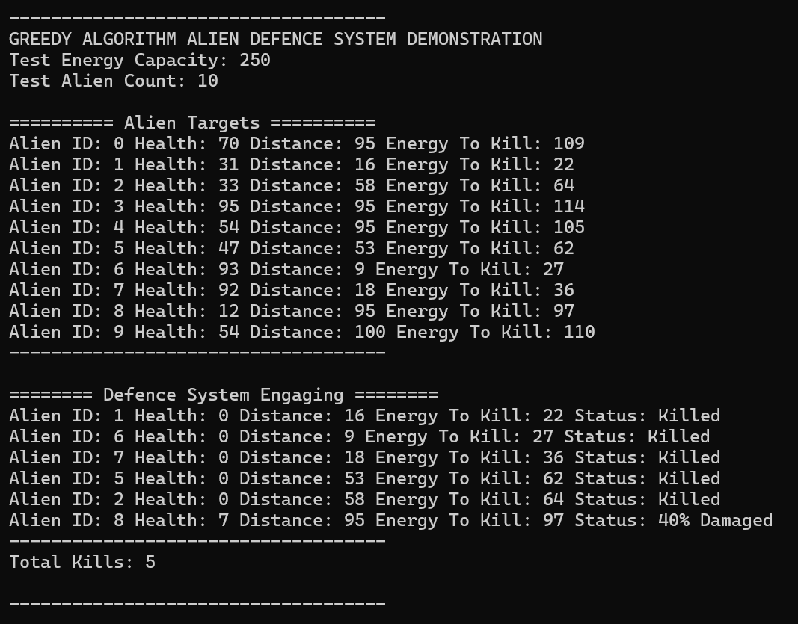

# Greedy Algorithm Designs

This document explains the design and reasoning behind the greedy strategies used in the project.  
Each example includes a clear explanation and accompanying diagrams/images.

---

## 1. Alien Defence System

### 📝 Overview
The goal of the alien defence system example is to demonstrate how a greedy algorithm can be used in a game-related setting.  
Inspired by the sentry gun scene from *Aliens*, the defence system is given a fixed amount of energy and must kill as many aliens as possible.

This type of design is commonly seen in defence or resource-management games where automated turrets handle waves of enemies.

---

### ⚠️ The Problem
Aliens are swarming the player's defences. The sentry gun must eliminate **as many targets as possible** before running out of energy.

---

### 🎯 The Greedy Choice
To maximise efficiency, the defence system attacks aliens **in ascending order of the energy required to kill them**.

This is based on:
- The alien’s distance to the turret  
- The alien’s health  
- The computed *energy-to-kill* value  

If the turret does not have enough energy to kill the final alien, it will deal **as much damage as possible** before shutting down.

---

### ✔️ Why This Works
Prioritising the *cheapest* targets guarantees the turret achieves the **maximum number of kills** before running out of energy.  
This is the essence of a greedy algorithm:  
> Always pick the locally optimal (least expensive) choice to maximise the global outcome.

---

## 📊 Defence System Diagrams

### **1. Pre Engagement**
Before attacking, the system calculates each alien’s distance, health, and total energy-to-kill value.  
These values are stored in a vector and sorted from **lowest → highest** energy required.

---

### **2. Post Engagement**
Now that the system has calculated and killed all possible enemies, it has powered down.
We can see here the amount of aliens it managed to kill before doing so.

---

### **3. System Output**
This is what it looks like in the console app, we have all of our aliens displayed.
We then display the defence systems results and what aliens it was able to damage and kill.

---

